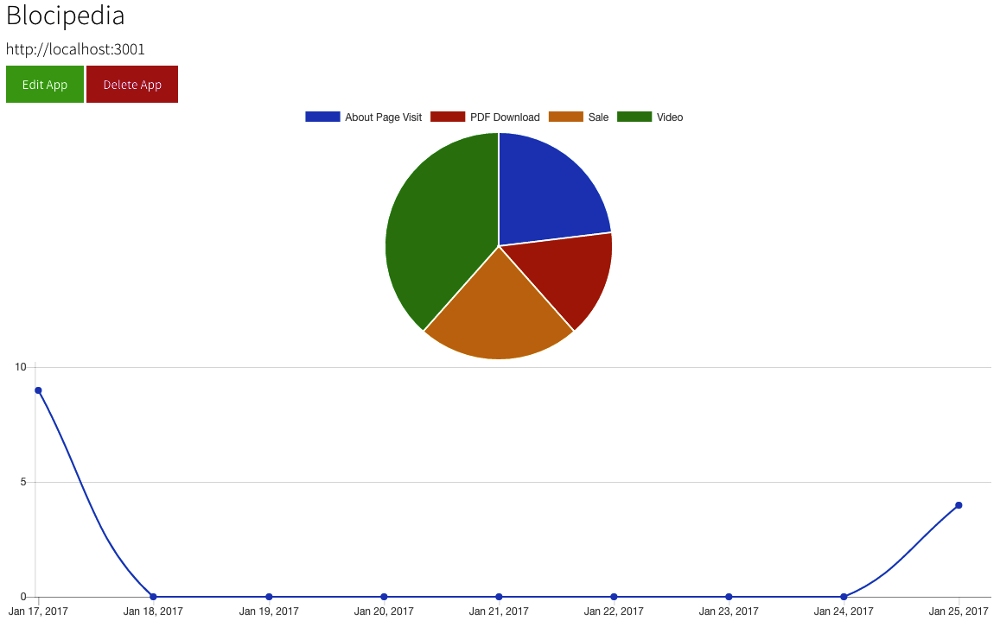

# Scrutinize
[](https://codeclimate.com/repos/588fecfe03e89e1553004f2a/feed)
#### Written in Ruby, JavaScript, Haml & CSS.

You can checkout Scrutinize [here](https://tranquil-sands-50425.herokuapp.com/). Check out this analytics service to track events on your registered websites.

###Features:

* A client-side JavaScript snippet that allows a user to track events on their website.
* A server-side API that captures and saves those events to a database.
* A Rails 5 application that displays the captured event data for a user.

###Getting Started:

* Sign up and register your website on [Scrutinize](https://tranquil-sands-50425.herokuapp.com/).

* Add the following JavaScript snippet to the `application.js` file on your website:

```
var scrutinize = {};
  scrutinize.report = function(eventName){
    var event = {event: { name: eventName }};

    var request = new XMLHttpRequest();

    request.open("POST", "http://tranquil-sands-50425.herokuapp.com/api/events", true);

    request.setRequestHeader('Content-Type', 'application/json');

    request.send(JSON.stringify(event));
  };
```
* Add the `scrutinize.report` function to the bottom of the desired page. For example, the script below was inserted at the bottom of the About Page.

```
<script type="text/javascript">
    $(document).on("ready page:load", function () {
       scrutinize.report("About Page Visit");
     })
</script>
```
That's it! Scrutinize will then track the events from your registered website.



